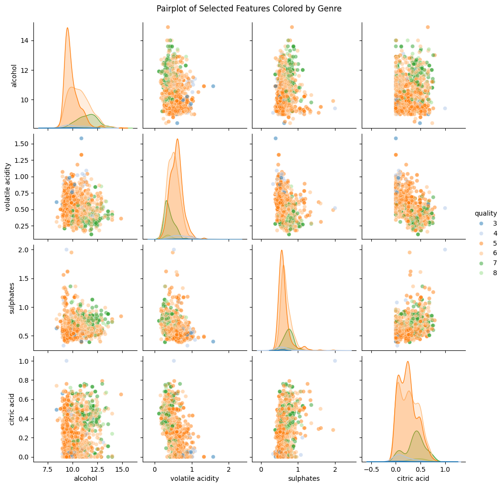

# Multi-Layer Perceptron Classification from Scratch

## Table of Contents
- [Introduction](#introduction)
- [Dataset Analysis and Preprocessing](#dataset-analysis-and-preprocessing)
  - [Describing the Dataset](#describing-the-dataset)
  - [Distribution and Correlation Analysis](#distribution-and-correlation-analysis)
  - [Data Normalization and Standardization](#data-normalization-and-standardization)
- [MLP Classifier Model](#mlp-classifier-model)
  - [Model Architecture](#model-architecture)
  - [Activation Functions](#activation-functions)
  - [Optimization Techniques](#optimization-techniques)
  - [Training the MLP Classifier](#training-the-mlp-classifier)
  - [Gradient Checking](#gradient-checking)
- [Hyperparameter Tuning and Weights & Biases Integration](#hyperparameter-tuning-and-weights--biases-integration)
  - [Tracking with W&B](#tracking-with-wb)
  - [Hyperparameter Effects](#hyperparameter-effects)
- [Multi label Classification](#multi-label-classification)
- [Conclusion](#conclusion)
- [References](#references)

## Introduction

This project involves building a Multi-Layer Perceptron (MLP) to implement a classifier, regressor, and autoencoder. 

The classifer model is designed to classify wine quality from the Wine Quality dataset (`WineQT.csv`), using various activation functions and optimization techniques. We also log and track the model's performance with Weights & Biases (W&B) to facilitate hyperparameter tuning.

The regressor is used to predict housing prices from the Housing dataset (`HousingData.csv`),

## Dataset Analysis and Preprocessing

### Describing the Dataset

I have a class called DataExploration:
    
    def __init__(self,df):
        self.df = df

    def describe_dataset(self, print_all):
        if print_all:
            print(self.df.describe())
        # print(self.df.head())
        # print(self.df.info())

    def correlation_list(self, printer):
        correlationdict = {}        
        for feature in self.df.columns:
            correlation = self.df[feature].corr(self.df['quality'])
            correlationdict[feature] = correlation

        average_correlation = {}

        for feature, correlation_value in correlationdict.items():
            average_correlation[feature] = abs(correlation_value)

        sorted_table = sorted(average_correlation.items(), key=lambda item: item[1], reverse=True)

        headers = ["Feature", "Absolute Correlation"]
        if printer:
            print(tabulate(sorted_table, headers, tablefmt="grid"))
            
### Dataset Overview

The dataset used in this project is the Wine Quality dataset, which includes several chemical properties of wine that are used to predict its quality. Below is a summary of the descriptive statistics for each feature:

| Feature                | Count  | Mean      | Std       | Min       | 25%       | 50%       | 75%       | Max       |
|------------------------|--------|-----------|-----------|-----------|-----------|-----------|-----------|-----------|
| **Fixed Acidity**       | 1143   | 8.311     | 1.748     | 4.600     | 7.100     | 7.900     | 9.100     | 15.900    |
| **Volatile Acidity**    | 1143   | 0.531     | 0.180     | 0.120     | 0.393     | 0.520     | 0.640     | 1.580     |
| **Citric Acid**         | 1143   | 0.268     | 0.197     | 0.000     | 0.090     | 0.250     | 0.420     | 1.000     |
| **Residual Sugar**      | 1143   | 2.532     | 1.356     | 0.900     | 1.900     | 2.200     | 2.600     | 15.500    |
| **Chlorides**           | 1143   | 0.087     | 0.047     | 0.012     | 0.070     | 0.079     | 0.090     | 0.611     |
| **Free Sulfur Dioxide** | 1143   | 15.615    | 10.250    | 1.000     | 7.000     | 13.000    | 21.000    | 68.000    |
| **Total Sulfur Dioxide**| 1143   | 45.915    | 32.782    | 6.000     | 21.000    | 37.000    | 61.000    | 289.000   |
| **Density**             | 1143   | 0.997     | 0.002     | 0.990     | 0.996     | 0.997     | 0.998     | 1.004     |
| **pH**                  | 1143   | 3.311     | 0.157     | 2.740     | 3.205     | 3.310     | 3.400     | 4.010     |
| **Sulphates**           | 1143   | 0.658     | 0.170     | 0.330     | 0.550     | 0.620     | 0.730     | 2.000     |
| **Alcohol**             | 1143   | 10.442    | 1.082     | 8.400     | 9.500     | 10.200    | 11.100    | 14.900    |
| **Quality**             | 1143   | 5.657     | 0.806     | 3.000     | 5.000     | 6.000     | 6.000     | 8.000     |
| **Id**                  | 1143   | 804.969   | 464.000   | 0.000     | 411.000   | 794.000   | 1209.500  | 1597.000  |


### Correlation List

The table below shows the absolute correlation between each feature and the target variable (`quality`). The closer the value is to 1, the stronger the feature's correlation with wine quality.

```plaintext
+---------------------------+------------------------+
| Feature                   |   Absolute Correlation  |
+===========================+========================+
| quality                   |              1.000000   |
+---------------------------+------------------------+
| alcohol                   |              0.484866   |
+---------------------------+------------------------+
| volatile acidity           |              0.407394   |
+---------------------------+------------------------+
| sulphates                  |              0.257710   |
+---------------------------+------------------------+
| citric acid                |              0.240821   |
+---------------------------+------------------------+
| total sulfur dioxide       |              0.183339   |
+---------------------------+------------------------+
| density                    |              0.175208   |
+---------------------------+------------------------+
| chlorides                  |              0.124085   |
+---------------------------+------------------------+
| fixed acidity              |              0.121970   |
+---------------------------+------------------------+
| Id                         |              0.069708   |
+---------------------------+------------------------+
| free sulfur dioxide        |              0.063260   |
+---------------------------+------------------------+
| pH                         |              0.052453   |
+---------------------------+------------------------+
| residual sugar             |              0.022002   |
+---------------------------+------------------------+
```

### Key Insights:

- The **fixed acidity** ranges from 4.6 to 15.9, with a mean of 8.31. This indicates that the wines in this dataset generally have moderate acidity.
- **Volatile acidity** has a low mean (0.53), but it can go as high as 1.58, indicating the presence of some wines with high acidity, which could negatively affect quality.
- The **citric acid** feature has a relatively low average (0.268), and some wines in the dataset contain no citric acid at all.
- **Residual sugar** shows significant variance, with some wines having up to 15.5 units of sugar.
- **Chlorides**, a measure of saltiness, has a mean of 0.087, but certain wines have much higher values (up to 0.611).
- **Sulfur dioxide** levels also vary widely, with some wines having much higher amounts of **total sulfur dioxide** (up to 289) compared to others.
- **pH** values suggest most wines in the dataset are slightly acidic, with values ranging between 2.74 and 4.01.
- The **alcohol** content varies significantly, with the minimum at 8.4% and the maximum at 14.9%.
- **Quality** scores are mostly centered around 5 and 6, with very few wines scoring 3 or 8, indicating a moderate distribution of quality.

### Distribution and Correlation Analysis
I plot the histogram of features, correlation matrix, and pairplot the features. 

### Histogram:


### Correlation Matrix (Heatmap):


### Pairplot top features:


### Pairplot all features:


### Data Normalization and Standardization
From the class I call DataSplit:

    def normalize_data(self):
        features = self.df.drop(columns=['quality', 'Id'])
        labels = self.df['quality']
    
        ss = StandardScaler()
        features_standardized = ss.fit_transform(features)
        
        normz = MinMaxScaler()
        features_normalized = normz.fit_transform(features_standardized)

        df_normalized = pd.DataFrame(features_normalized, columns=features.columns)

        df_normalized['quality'] = labels.values
        df_normalized['Id'] = self.df['Id']

        path = 'C:/Users/raaga/OneDrive/Desktop/IIIT-H/3-1/SMAI/smai-m24-assignments-rraagav/data/interim/3/WineQT_Normalized.csv'
        df_normalized.to_csv(path, index=False)  

        return df_normalized

    def split_data(self, data):
        features = data.drop(columns=['quality', 'Id'])
        # features = data[['alcohol', 'volatile acidity', 'sulphates', 'citric acid']]      
        labels = pd.Categorical(data['quality']).codes

        # print("Original labels:")
        # print(data['quality'].unique())
        
        # print("\nEncoded labels:")
        # print(np.unique(labels))
        
        # # Display the distribution of labels
        # print('\nDistribution of the original labels:')
        # print(data['quality'].value_counts())
        
        np.random.seed(42)
        indices = np.arange(len(features))
        np.random.shuffle(indices)

        train_size = 0.8
        train_index = int(len(features) * train_size)

        val_size = 0.1
        val_index = int(len(features) * val_size)
        
        train_indices = indices[:train_index]
        val_indices = indices[train_index:train_index+val_index]
        test_indices = indices[train_index+val_index:]
    
        X_train = features.iloc[train_indices].values
        y_train = labels[train_indices]

        X_eval = features.iloc[val_indices].values
        y_eval = labels[val_indices]

        X_test = features.iloc[test_indices].  values
        y_test = labels[test_indices]

        return X_train, y_train, X_eval, y_eval, X_test, y_test

I normalize my data using sklearn, there's no missing data, its all made consistent with MinMax Scaling and Standard Scaling. 

## MLP Classifier Model

### Model Architecture:
The `MLP_Classifier` class is designed to support flexibility in terms of architecture. The user can specify the number of hidden layers, neurons per layer, activation functions, optimizers, and learning rate, all of which are set through the `set_params()` method.

```python
def set_params(self, alpha, activation_function, optimizer, hidden_layers, neurons_per_layer, batch_size, epochs):
    self.alpha = alpha
    self.set_activation_function(activation_function)
    self.optimizers = optimizer
    self.hidden_layers = hidden_layers
    self.neurons_per_layer = neurons_per_layer
    self.batch_size = batch_size
    self.epochs = epochs
```

- Learning rate, i.e. `alpha` controls the step size during the optimization process.

- Activation functions are `sigmoid`, `tanh`, `relu`; `linear` for comparison purposes.

- Optimizers (`SGD`, `Mini-Batch Gradient Descent`, `Batch Gradient Descent`) are implemented from scratch. 

The class also includes provisions for handling early stopping: based on , which helps prevent overfitting.

### Activation Functions
Activation functions introduce non-linearity into the model. In this implementation, four key activation functions are included: `sigmoid`, `tanh`, `relu` and `linear`.

```python
def set_activation_function(self, func_name):
    if func_name == "sigmoid":
        self.activation_function = self.sigmoid
        self.activation_derivative = self.sigmoid_derivative
    elif func_name == "tanh":
        self.activation_function = self.tanh
        self.activation_derivative = self.tanh_derivative
    elif func_name == "relu":
        self.activation_function = self.relu
        self.activation_derivative = self.relu_derivative
    elif func_name == "linear":
        self.activation_function = self.linear
        self.activation_derivative = self.linear_derivative
```

### Optimization Techniques
The model supports three key optimizers:

`Stochastic Gradient Descent (SGD)`: Updates weights for each training sample.

`Mini-Batch Gradient Descent`: Updates weights after a small batch of samples.

`Batch Gradient Descent (BGD)`: Updates weights after evaluating the entire datase

```python
    def bgd(self, X_train, y_train):
        activations, Zs = self.forward(X_train)
        gradients_w, gradients_b = self.backward(activations, Zs, y_train)
        self.update_parameters(gradients_w, gradients_b)
        loss = self.compute_loss(activations[-1], y_train)
        accuracy = self.compute_accuracy(activations[-1], y_train)
        return loss, accuracy
    
    def mini_bgd(self, X_train, y_train):
        m = X_train.shape[0]
        perm = np.random.permutation(m)
        X_shuffled = X_train[perm]
        y_shuffled = y_train[perm]
        num_batches = int(np.ceil(m / self.batch_size))
        for i in range(num_batches):
            start = i * self.batch_size
            end = min(start + self.batch_size, m)
            X_batch = X_shuffled[start:end]
            y_batch = y_shuffled[start:end]
            activations, Zs = self.forward(X_batch)
            gradients_w, gradients_b = self.backward(activations, Zs, y_batch)
            self.update_parameters(gradients_w, gradients_b)
        activations, _ = self.forward(X_train)
        loss = self.compute_loss(activations[-1], y_train)
        accuracy = self.compute_accuracy(activations[-1], y_train)
        return loss, accuracy
    
    def sgd(self, X_train, y_train):
        m = X_train.shape[0]
        perm = np.random.permutation(m)
        X_shuffled = X_train[perm]
        y_shuffled = y_train[perm]
        for i in range(m):
            X_sample = X_shuffled[i:i+1]
            y_sample = y_shuffled[i:i+1]
            activations, Zs = self.forward(X_sample)
            gradients_w, gradients_b = self.backward(activations, Zs, y_sample)
            
            self.update_parameters(gradients_w, gradients_b)
        activations, _ = self.forward(X_train)
        loss = self.compute_loss(activations[-1], y_train)
        accuracy = self.compute_accuracy(activations[-1], y_train)
        return loss, accuracy
```
### Training the MLP Classifier
Training the model involves forward propagation, backward propagation, and weight updates. This is controlled by the fit() method. The model also incorporates early stopping, which terminates training if no improvement is observed in the validation loss over a certain number of epochs.

I have my `fit()` and `predict()` routines here:
```python
    def fit(self, X_train, y_train, early_stopping, patience=5):
        m = X_train.shape[0]
        best_loss = float('inf')
        patience_counter = 0
        self.initialize_weights()
        
        for epoch in range(self.epochs):
            if self.optimizers == 'bgd':
                epoch_loss, epoch_accuracy = self.bgd(X_train, y_train)
            elif self.optimizers == 'mini_bgd':
                epoch_loss, epoch_accuracy = self.mini_bgd(X_train, y_train)
            elif self.optimizers == 'sgd':
                epoch_loss, epoch_accuracy = self.sgd(X_train, y_train)
            else:
                raise ValueError("Invalid optimizer name")
            
            self.losses.append(epoch_loss)
            self.accuracies.append(epoch_accuracy)

            # Early stopping part
            if early_stopping:
                if epoch_loss < best_loss:
                    best_loss = epoch_loss
                    patience_counter = 0
                else:
                    patience_counter += 1
                if patience_counter > patience:
                    print(f"Early stopping at epoch {epoch+1}")
                    break
            print(f"Epoch {epoch+1}/{self.epochs}, Loss: {epoch_loss:.4f}, Accuracy: {epoch_accuracy:.4f}")
```

```python
    def predict(self, X):
        activations, Zs = self.forward(X)
        y_pred = np.argmax(activations[-1], axis=1)
        return y_pred
```
### Gradient Checking
To ensure the correctness of backpropagation, the `gradient_check()` method verifies computed gradients against numerically approximated gradients, ensuring model correctness during training.

```python
  
    def gradient_check(self, X, y, epsilon=1e-7):
        activations, Zs = self.forward(X)
        gradients_w, gradients_b = self.backward(activations, Zs, y)
        
        params = []
        grads = []
        for w, b in zip(self.weights, self.biases):
            params.extend([w, b])
        for gw, gb in zip(gradients_w, gradients_b):
            grads.extend([gw, gb])
        
        num_grads = []
        for param in params:
            num_grad = np.zeros_like(param)
            iterator = np.nditer(param, flags=['multi_index'], op_flags=['readwrite'])
            while not iterator.finished:
                idx = iterator.multi_index
                original_value = param[idx]
                
                param[idx] = original_value + epsilon
                activations_plus, _ = self.forward(X)
                loss_plus = self.compute_loss(activations_plus[-1], y)
                
                param[idx] = original_value - epsilon
                activations_minus, _ = self.forward(X)
                loss_minus = self.compute_loss(activations_minus[-1], y)
                
                param[idx] = original_value
                
                num_grad[idx] = (loss_plus - loss_minus) / (2 * epsilon)
                iterator.iternext()
            num_grads.append(num_grad)
        
        for i in range(len(grads)):
            grad = grads[i]
            num_grad = num_grads[i]

            # Relative error
            numerator = np.linalg.norm(grad - num_grad)
            denominator = np.linalg.norm(grad) + np.linalg.norm(num_grad) + 1e-8
            relative_error = numerator / denominator
            print(f"Parameter {i+1} - Relative Error: {relative_error:.10e}")
            if relative_error > 1e-5:
                print("Gradients dont match!!!vfgsdgbhjxndwgtbeiurowefnipwmod.")
                return
        print("It worksssssssssssssssss")
```
## Hyperparameter Tuning and Weights & Biases Integration
By integrating Weights & Biases (W&B), we can automatically track and log model metrics (e.g., loss, accuracy, precision) and experiment with different hyperparameters. A sweep configuration is defined to automate tuning for multiple combinations of learning rate, batch size, and activation functions.

```python
sweep_config = {
    'method': 'grid',
    'metric': {
        'name': 'final_val_accuracy',
        'goal': 'maximize'
    },
    'parameters': {
        'alpha': {
            'values': [0.01, 0.1]
        },
        'activation_function': {
            'values': ['relu', 'tanh', 'sigmoid', 'linear']
        },
        'optimizer': {
            'values': ['sgd', 'bgd']
        },
        'architecture': {
            'values': [
                {'hidden_layers': 1, 'neurons_per_layer': [32]},
                {'hidden_layers': 2, 'neurons_per_layer': [64, 32]}
            ]
        },
        'batch_size': {
            'values': [16, 32]
        },
        'epochs': {
            'value': 50
        }
    }
}
```
### Tracking with W&B

The tables are found in figures. 

### How does accuracy vary with changing hyperparameters?


The best accuracy I got, was with 3 hidden layers [128, 64, 32], alpha = 0.01, sgd, and tanh activation over 50 epochs.

### Assessing my Best Model:
Test Loss: 1.0831, Test Accuracy: 0.5391
Test Precision: 0.4606, Test Recall: 0.5391, Test F1: 0.4964

Train Loss: 1.1399, Train Accuracy: 0.5033
Train Precision: 0.4259, Train Recall: 0.5033, Train F1: 0.4563

Eval Loss: 1.0899, Eval Accuracy: 0.5263
Eval Precision: 0.4877, Eval Recall: 0.5263, Eval F1: 0.4838

### Varying the Hyperparameters

#### 1. **Effect of Non-linearity:**

Non-linear activation functions play a crucial role in introducing complexity and learning capacity into a neural network. In this experiment, we tested the performance of four commonly used activation functions: `sigmoid`, `tanh`, `ReLU`, and `linear`. The following table summarizes the results from the experiments:

| Activation Function | Test Loss | Test Accuracy | Test Precision | Test Recall | Test F1 Score |
|---------------------|-----------|---------------|----------------|-------------|---------------|
| Sigmoid             | 1.1325    | 49.57%        | 24.57%         | 49.57%      | 32.85%        |
| Tanh                | 1.0818    | 52.17%        | 44.38%         | 52.17%      | 47.77%        |
| ReLU                | 1.2216    | 39.13%        | 62.73%         | 39.13%      | 25.73%        |
| Linear              | 1.0945    | 48.70%        | 42.31%         | 48.70%      | 44.07%        |

**Key Observations:**
- The **Tanh** activation function provided the best overall balance between **accuracy** (52.17%) and **F1 score** (47.77%). This suggests that Tanh is better suited for the dataset.
- **Sigmoid** performed poorly, with low precision and F1 score. This could be due to the vanishing gradient problem that often affects sigmoid in deeper layers.
- **ReLU** resulted in high precision but poor F1 and accuracy scores, indicating that while it correctly classified some instances, its predictions were inconsistent.
- **Linear** activation performed similarly to sigmoid but with a slightly higher precision and F1 score&#8203;:contentReference[oaicite:0]{index=0}.

#### 2. **Effect of Learning Rate:**

The learning rate controls how much the model adjusts the weights with respect to the gradient during training. We experimented with four different learning rates: 0.001, 0.01, 0.1, and 0.5. The results are as follows:

| Learning Rate | Test Loss | Test Accuracy | Test Precision | Test Recall | Test F1 Score |
|---------------|-----------|---------------|----------------|-------------|---------------|
| 0.001         | 1.0773    | 56.52%        | 48.23%         | 56.52%      | 52.01%        |
| 0.01          | 1.0887    | 55.65%        | 47.52%         | 55.65%      | 51.21%        |
| 0.1           | 1.1367    | 49.57%        | 24.57%         | 49.57%      | 32.85%        |
| 0.5           | 16.4100   | 10.43%        | 1.09%          | 10.43%      | 1.97%         |

**Key Observations:**
- The lowest learning rate of **0.001** resulted in the highest test accuracy (56.52%) and F1 score (52.01%). It allowed the model to learn at a slower but more consistent pace.
- **0.01** also performed well, with slightly lower accuracy (55.65%) and F1 score (51.21%).
- Higher learning rates (0.1 and 0.5) significantly degraded model performance, especially **0.5**, which resulted in a loss of learning control, leading to extremely poor results&#8203;:contentReference[oaicite:1]{index=1}.

#### 3. **Effect of Batch Size:**

Batch size affects the stability and speed of the learning process. Smaller batch sizes tend to introduce more noise in the gradient, leading to slower but more fine-grained learning. We tested batch sizes of 16, 32, 64, and 128, with the following results:

| Batch Size | Test Loss | Test Accuracy | Test Precision | Test Recall | Test F1 Score |
|------------|-----------|---------------|----------------|-------------|---------------|
| 16         | 1.0807    | 54.78%        | 47.26%         | 54.78%      | 50.21%        |
| 32         | 1.0489    | 57.39%        | 51.23%         | 57.39%      | 51.41%        |
| 64         | 1.0724    | 53.04%        | 45.38%         | 53.04%      | 48.22%        |
| 128        | 1.1125    | 44.35%        | 39.27%         | 44.35%      | 36.91%        |

**Key Observations:**
- A batch size of **32** performed the best in terms of **accuracy** (57.39%) and **F1 score** (51.41%). This indicates that `batch size 32` offered the best trade-off between noise and computational efficiency.
- Smaller batch sizes (e.g., 16) introduced more noise but still performed well (54.78% accuracy).
- Larger batch sizes (64 and 128) showed a drop in performance, with batch size 128 resulting in the lowest test accuracy (44.35%)&#8203;:contentReference[oaicite:2]{index=2}.

---
## Multi label Classification

## Data processing
`normalize_data()`
This function performs several preprocessing steps on a dataset, which includes encoding categorical variables, scaling numerical values, and preparing multi-label columns.

Key Steps:

`Dropping Unnecessary Columns:` The function first drops columns like occupation, city, and most bought item, as they are either not relevant to the model or need more advanced processing.

`Label Encoding (gender, married):` Categorical features such as gender and married are converted to numerical representations using LabelEncoder. This method replaces categories with integer labels.

Ordinal Encoding (education): For the education feature, an ordinal relationship between categories (e.g., High School < Bachelor < Master < PhD) is encoded manually by mapping each education level to a corresponding integer value.

Standardizing Numerical Values (income, purchase_amount): Numerical features, income and purchase_amount, are scaled using StandardScaler, which standardizes the data to have a mean of 0 and a standard deviation of 1. This helps ensure that features are on the same scale, which improves the performance of many machine learning models.

Multi-label Encoding (labels): The labels column contains multiple labels for each instance, stored as a string of space-separated labels (e.g., "label1 label2"). These are first split into lists using split(). Then, MultiLabelBinarizer is applied to one-hot encode the labels into separate columns, where each column corresponds to a possible label, and the values are binary (1 if the instance has the label, 0 otherwise).

## Model Architecture

The `MLP_MultiLabel_Classifier` is designed for multi-label classification, where each input can belong to multiple labels simultaneously. The model is composed of multiple hidden layers with customizable neurons, activation functions, and optimization techniques. The model’s key components include:

- **Input layer**: Takes in the input features.
- **Hidden layers**: A configurable number of layers, with each layer having a customizable number of neurons.
- **Output layer**: Uses a sigmoid activation function, outputting probabilities for each label.
  
The weights are initialized using Xavier initialization, and the optimizer used (SGD, Mini-Batch Gradient Descent, or Batch Gradient Descent) updates the weights and biases during training.

### Core Functions:
- **set_params**: Allows setting hyperparameters such as learning rate, activation function, optimizer, number of hidden layers, and batch size.
- **initialize_weights**: Initializes the weights and biases using Xavier initialization.
- **forward**: Performs the forward pass through the network.
- **backward**: Computes gradients during backpropagation.
- **update_parameters**: Updates the model’s weights and biases using gradient descent.

## Activation Functions

The model supports four types of activation functions, which introduce non-linearity into the network:
- **Sigmoid**: Typically used for binary classification tasks.
- **Tanh**: A scaled version of the sigmoid function.
- **ReLU (Rectified Linear Unit)**: Efficient and commonly used in deep learning.
- **Linear**: Useful for regression tasks or layers without non-linearity.

The activation function is customizable and can be set during model initialization.

## Optimization Techniques

The model supports three types of optimization techniques:
- **Stochastic Gradient Descent (SGD)**: Updates weights based on individual samples.
- **Mini-Batch Gradient Descent**: Updates weights based on small batches of data, providing a balance between SGD and full-batch gradient descent.
- **Batch Gradient Descent (BGD)**: Updates weights based on the entire dataset in each iteration.

## Training the MLP Multi-Label Classifier

The model is trained using one of the selected optimizers, and each epoch calculates the loss using binary cross-entropy. The model supports early stopping, where training halts if no improvement is observed for a certain number of epochs (patience).

### Key Steps:
1. **Forward Pass**: Calculates the output by performing forward propagation through the layers.
2. **Backward Pass**: Computes gradients using backpropagation.
3. **Weight Updates**: Updates weights using gradient descent based on the chosen optimizer.
4. **Evaluation**: After each epoch, the model evaluates itself on validation data (if available), computing metrics such as accuracy, precision, recall, F1 score, and Hamming loss.

## Hyperparameter Tuning and Weights & Biases Integration

The model is integrated with **Weights & Biases (W&B)** for logging and tracking hyperparameters during training. A **sweep configuration** is used to explore different sets of hyperparameters to find the optimal settings for learning rate, batch size, activation function, and number of hidden layers.

### Sweep Configuration:
The W&B sweep uses a grid search over the following parameters:
- **Alpha (learning rate)**: [0.01, 0.1]
- **Activation Function**: [ReLU, Tanh, Sigmoid]
- **Optimizer**: [SGD]
- **Architecture**: Different combinations of hidden layers and neurons per layer.
- **Batch Size**: [16]
- **Epochs**: Fixed at 50

Example sweep configuration:

```python
multilabel_sweep_config = {
    'method': 'grid',
    'metric': {
        'name': 'final_val_accuracy',
        'goal': 'maximize'
    },
    'parameters': {
        'alpha': {
            'values': [0.01, 0.1]
        },
        'activation_function': {
            'values': ['relu', 'tanh', 'sigmoid']
        },
        'optimizer': {
            'values': ['sgd']
        },
        'architecture': {
            'values': [
                {'hidden_layers': 1, 'neurons_per_layer': [32]},
                {'hidden_layers': 2, 'neurons_per_layer': [64, 32]},
                {'hidden_layers': 3, 'neurons_per_layer': [128, 64, 32]}
            ]
        },
        'batch_size': {
            'values': [16]
        },
        'epochs': {
            'value': 50
        }
    }
}
```

## MLP Regression:

# Describe Data: Boston Housing Dataset Summary

This README provides a summary of the dataset statistics and the absolute correlation between features and the target variable, `MEDV` (Median value of owner-occupied homes).

## Dataset Statistics

| Feature   |   Count   |   Mean   |   Std   |   Min   |   25%   |   50%   |   75%   |   Max   |
|-----------|-----------|----------|---------|---------|---------|---------|---------|---------|
| CRIM      |   486     |  3.6119  |  8.7202 |  0.0063 |  0.0819 |  0.2537 |  3.5603 | 88.9762 |
| ZN        |   486     | 11.2119  | 23.3889 |  0.0000 |  0.0000 |  0.0000 | 12.5000 | 100.000 |
| INDUS     |   486     | 11.0840  |  6.8359 |  0.4600 |  5.1900 |  9.6900 | 18.1000 | 27.7400 |
| CHAS      |   486     |  0.0700  |  0.2553 |  0.0000 |  0.0000 |  0.0000 |  0.0000 |  1.0000 |
| NOX       |   506     |  0.5547  |  0.1159 |  0.3850 |  0.4490 |  0.5380 |  0.6240 |  0.8710 |
| RM        |   506     |  6.2846  |  0.7026 |  3.5610 |  5.8855 |  6.2085 |  6.6235 |  8.7800 |
| AGE       |   486     | 68.5185  | 27.9995 |  2.9000 | 45.1750 | 76.8000 | 93.9750 | 100.000 |
| DIS       |   506     |  3.7950  |  2.1057 |  1.1296 |  2.1002 |  3.2074 |  5.1884 | 12.1265 |
| RAD       |   506     |  9.5494  |  8.7073 |  1.0000 |  4.0000 |  5.0000 | 24.0000 | 24.0000 |
| TAX       |   506     | 408.2372 | 168.5371| 187.000 | 279.000 | 330.000 | 666.000 | 711.000 |
| PTRATIO   |   506     | 18.4555  |  2.1649 | 12.6000 | 17.4000 | 19.0500 | 20.2000 | 22.0000 |
| B         |   506     | 356.6740 | 91.2949 |  0.3200 | 375.3775| 391.4400| 396.2250| 396.9000 |
| LSTAT     |   486     | 12.7154  |  7.1559 |  1.7300 |  7.1250 | 11.4300 | 16.9550 | 37.9700 |
| MEDV      |   506     | 22.5328  |  9.1971 |  5.0000 | 17.0250 | 21.2000 | 25.0000 | 50.0000 |

## Feature Correlation with Target (MEDV)

The table below shows the absolute correlation between the features and `MEDV`:

| Feature   |   Absolute Correlation |
|-----------|------------------------|
| MEDV      |               1.000000 |
| LSTAT     |               0.735822 |
| RM        |               0.695360 |
| PTRATIO   |               0.507787 |
| INDUS     |               0.481772 |
| TAX       |               0.468536 |
| NOX       |               0.427321 |
| AGE       |               0.394656 |
| CRIM      |               0.391363 |
| RAD       |               0.381626 |
| ZN        |               0.373136 |
| B         |               0.333461 |
| DIS       |               0.249929 |
| CHAS      |               0.181391 |

## Key Insights:
- `LSTAT` and `RM` show the highest correlation with `MEDV`, indicating they are strong predictors.
- Features such as `PTRATIO`, `INDUS`, and `TAX` also have a moderate correlation with the target.
- `CHAS` has the lowest correlation with `MEDV`, implying it may not be as influential in predicting housing prices.

# Visualizing

### Correlation Matrix 


### Histogram of Features


### Pairplot of top Features


### Pairplot of all Features

